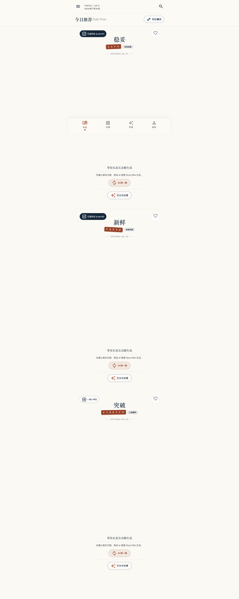
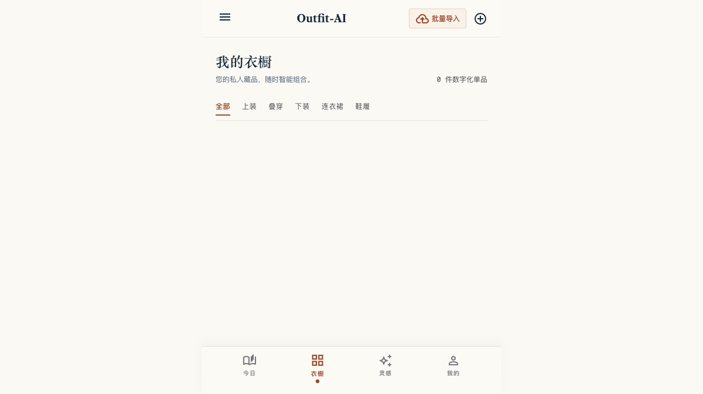
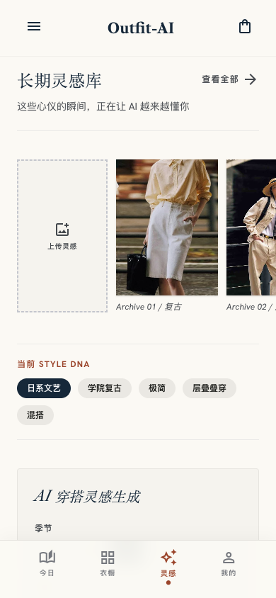
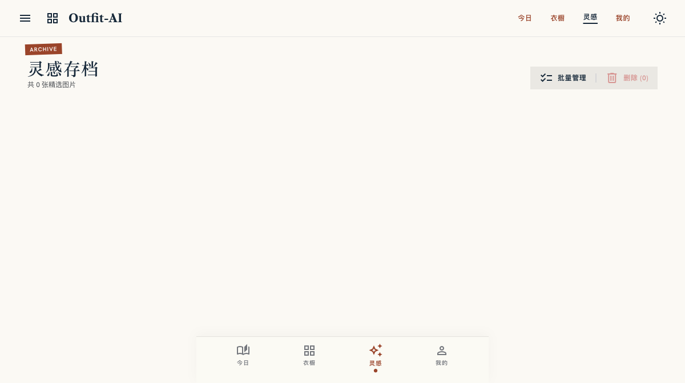
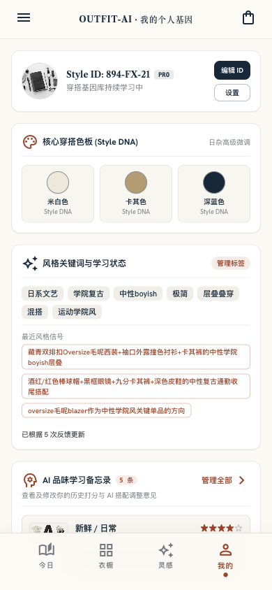

# Outfit-AI

个人 AI 衣橱与穿搭灵感应用：把真实衣物变成可检索、可编辑的数字衣橱，再结合用户的长期 Style DNA、当天位置天气和场景，每天生成三套可执行的穿搭建议。

当前版本先以移动端优先的 H5 运行，前端视觉与交互基于用户确认的 Google AI Studio / Stitch React 导出包迁移而来。

## 页面预览

以下截图来自当前 React 前端的移动端布局（390 × 844）。真实衣橱、灵感图片和推荐数据在运行时从本地 SQLite / API 加载；截图用于展示界面结构与核心功能，具体内容会随用户数据变化。

<table>
  <tr>
    <td align="center"><strong>今日推荐</strong><br><sub>天气、三种风格、逐件穿搭顺序</sub><br></td>
    <td align="center"><strong>我的衣橱</strong><br><sub>批量导入、分类浏览、真实单品</sub><br></td>
  </tr>
  <tr>
    <td align="center"><strong>长期灵感库</strong><br><sub>灵感上传、Style DNA、AI 生图入口</sub><br></td>
    <td align="center"><strong>灵感存档</strong><br><sub>标签化管理、失败状态、紧凑网格</sub><br></td>
  </tr>
  <tr>
    <td align="center"><strong>我的 Style DNA</strong><br><sub>色板、风格关键词、AI 品味备忘录</sub><br></td>
    <td></td>
  </tr>
</table>

## 核心工作流

### 1. 真实衣橱

1. 批量上传真实衣物图片。
2. 本地 `rembg` 去除背景，保留透明商品图。
3. MiniMax VLM 识别并结构化提取品类、颜色、材质、厚薄度、版型、季节、场景和风格标签。
4. 用户可以确认或编辑 AI 识别结果；只有确认后的单品进入推荐候选池。
5. 衣橱按“全部 / 上装 / 下装 / 鞋履 / 配饰”浏览，支持单品详情、左右滑动预览和删除/编辑能力。

### 2. 长期灵感库

- 支持一次选择多张灵感图上传。
- VLM 提取色彩关系、叠穿方式、风格、配饰、季节和场景等信息。
- 分析结果沉淀到 Style DNA、核心标签和品味备忘录。
- 灵感存档使用紧凑网格；点击图片可以放大，并左右滑动切换相邻图片。

### 3. 每日推荐

- 根据当前位置或手动城市获取当地天气、温度、日期和降雨信息。
- 每天 06:30（Asia/Shanghai）由服务器预生成 Safe / Fresh / Stretch 三套推荐；超时、网络异常或模型工具调用异常时最多自动重试 1 次，确定性配置错误不重试。
- 每套 Look 按真实穿衣顺序展示 3–6 件：帽子/围巾等配饰 → 外套/上装 → 下装 → 鞋履。
- “AI 换一换”只替换当前点击的 Look，不影响另外两套。
- 推荐支持收藏、评分、标记穿过和历史归档，反馈用于更新品味备忘录。
- 手机桌面快捷方式从后台恢复时，今日页会自动检查当天推荐，不需要每次手动刷新。

### 4. 独立灵感生图

不依赖现有衣橱，使用长期灵感、Style DNA、季节和场景生成未来购物或换季尝试用的穿搭灵感图，并明确标注“不代表衣橱已有单品”。

## 技术架构

```text
React 19 + Vite + Tailwind CSS
            │ /api、/media
            ▼
FastAPI + SQLAlchemy 2.0 + SQLite
            ├─ rembg / Pillow：真实衣物去背景与拼图
            ├─ MiniMax VLM：衣物与灵感识图
            ├─ MiniMax-M3：Style DNA、品味归纳与穿搭推荐
            ├─ MiniMax image-01：独立灵感生图
            └─ Open-Meteo：天气数据（免 API Key）
```

规则只负责天气过滤、候选边界和结果校验；“哪套更好看”由 MiniMax-M3 结合 Style DNA 与用户反馈判断。

## 快速开始

要求：Python 3.11、Node.js 20+、`uv`。

```bash
# 终端 1：后端
cd backend
uv sync
# 可设置 MINIMAX_API_KEY；未设置时只读复用 ~/.mmx/config.json
uv run uvicorn outfit_ai.main:app --reload

# 终端 2：前端
cd frontend
npm install
npm run dev
```

- 前端：<http://localhost:5173>
- 后端 OpenAPI：<http://localhost:8000/docs>
- 健康检查：<http://localhost:8000/health>
- 默认数据目录：`~/.outfit-ai/`（SQLite 数据库与上传图片）

首次处理真实衣物时，`rembg` 使用约 176MB 的 U²-Net 本地模型并缓存到 `~/.u2net/`；应用显式复用该轻量模型，不会误触发约 1GB 的 Bria 默认模型。衣橱详情会显示单品的季节和厚薄度标签。

## 测试与构建

```bash
cd backend
uv run ruff check src tests
uv run pytest -q

cd ../frontend
npm test
npm run lint
npm run build
```

## 云端部署

项目已提供 Docker Compose 和 Ubuntu 部署脚本。生产环境需要准备 HTTPS 域名，并将用户图片迁移到对象存储（例如 OSS）。部署脚本会安装每日预生成任务：

```cron
30 6 * * * root /usr/bin/flock -n /run/lock/outfit-ai-precompute.lock /usr/local/sbin/outfit-ai-precompute
```

执行日志：`/var/log/outfit-ai-precompute.log`；预生成每次失败会回滚事务，重试成功后只写入一组三档。

```bash
DEPLOY_HOST=ubuntu@your-server-ip \
DEPLOY_PATH=/opt/outfit-ai \
bash scripts/deploy.sh
```

不要把 `.env`、MiniMax Key、SQLite 用户数据或上传图片提交到 Git。MiniMax 凭证只在后端读取环境变量或 `~/.mmx/config.json`。

## 当前文档

- [后端、数据模型与 API 规格](docs/SPEC.md)
- [前端页面、入口、功能与 API 映射](docs/frontend/CURRENT_FRONTEND_INTEGRATION.md)
- [个人 Web 部署说明](docs/DEPLOYMENT_PERSONAL_WEB.md)
- [项目开发规则](CLAUDE.md)

## 借鉴与署名

| 来源 | 许可证 | 借鉴内容 |
|---|---|---|
| [`jonnykate/ai-closet`](https://github.com/jonnykate/ai-closet) | MIT | LLM 调用、item 校验、失败重试、拼图与历史规避 |
| [`Gurshaan-Deol/Hangar`](https://github.com/Gurshaan-Deol/Hangar) | MIT | 上传状态机、Open-Meteo 天气与 AI 属性 schema |
| [`googlarz/fashion-skill`](https://github.com/googlarz/fashion-skill) | CC BY 4.0 | Style DNA 与实体字段抽象，未复制 prompt |

## License

MIT（待最终确认）。
